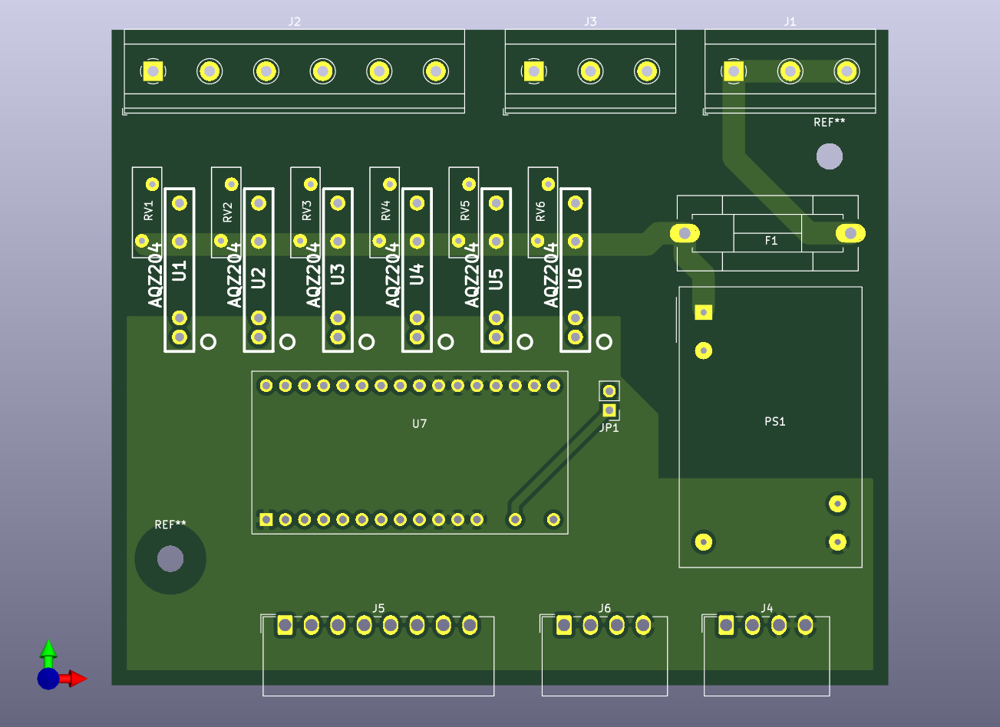

# Thermal actuator driver for homematic HmIP-MOD-OC8

This PCB controls up to 6 thermal actuators (230VAC) using a homematic [HmIP-MOD-OC8](https://de.elv.com/elv-homematic-ip-komplettbausatz-modulplatine-opencollector-8-fach-hmip-mod-oc8-fuer-smart-home-hausautomation-150850) module. To control the actuators solid state relays with FETs are used. TRIACs are problematic due to the minimum hold current. The board fits into the DIN rail case [APRA DB6 GBK](https://www.apra.de/produkte/apra-rail-db-serie/)

Schematic, Layout and Gerber files can be used without any warranties.
